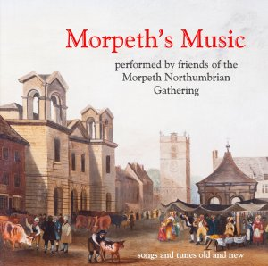

# Morpeth Music CD

Songs and tunes old and new from friends of the Gathering including Stewart Hardy, Alex Swailes, Voice Male, Ellington Colliery Band, Pipers’ Fancy, Benny Graham, Fligarishon, York Waits, Rod Arthur – £10 at our events; by post £12 incl. postage from Gathering Office.

## Song lyrics (PDF format)

[Jenny Armstrong](assets/pdfs/jenny-armstrong-song.pdf)

[Morpeth Carnival](assets/pdfs/morpeth-carnival-song.pdf)

[Morpeth Drovers](assets/pdfs/morpeth-drovers.pdf)

[Morpeth Lodgings](assets/pdfs/morpeth-lodgings.pdf)

[Morpeth Olympics](assets/pdfs/morpeth-olympics.pdf)

[Saney Ogilvie's Duel](assets/pdfs/sawney-ogilvies-duel-with-his-wife.pdf)

## From the sleeve notes

**[Skip to tracklist](#track-list)**

This CD of Morpeth's Music has been compiled as an anthology of songs and tunes relating to Morpeth in the heart of Northumberland. Itfeatures both traditional and modern compositions, many of which were commissioned in recent years for the Morpeth Northumbrian Gathering, the town's annual festival, held since 1968 on the weekend after Easter. We hope sales of this recording will make a vital contribution to Gathering coffers, so please respect its copyright!

The spoken extracts from old local writers, Borough minutes and court records interspersed amongst the songs are read by Rod Arthur, who grew up in Morpeth before leaving to pursue a distinguished career as actor and writer. On television he has starred in Prehistoric Park and appeared in Doctor Who & Coronation Street; he has been heard often on radio and has toured with the Royal Shakespeare Company.

Alistair Anderson, ace concertina-player & piper, long-time stalwart of our annual fund-raising winter concert, was commissioned to write The Morpeth Gathering Silver Jubilee to celebrate the 25th festival, way back in 1992. It's played here by Paul Knox, an excellent young exponent of the Northumbrian smallpipes. He is a member of both the Windy Gyle Band and fiddle trio King Cole, and has been a judge at the Gathering.

The Hopping Proclamation (a “hopping” or “hoppins” is a Northumbrian fair) and most of the other extracts read by Rod Arthur on this CD are from the Morpeth Court Rolls. These recorded the judgements and rulings of the manorial court over centuries of the town's history. They are used with the kind permission of the Howard family.

The sheet music for The Morpeth Carnival Song turned up in the archives of Morpeth Antiquarian Society. The song was written by Tot Garvie and Harry P Hutchinson (musical director of the Coliseum Cinema) for the 1928 Carnival, which raised money for a new Cottage Hospital. The song mentions the carnival king and queen; the “man who led them to France” was the mayor, WS Sanderson, well-known then for organising the post-WW1 pilgrimages to France and later for the original Sanderson Arcade development. Kim's vocals and kazoo are backed by John Bibby, who can't really play the tuba. For the coda Kim provides both clog dance and concertina in true Morpeth Minstrels style.

The Morpeth Rant, though not its original name, is the tune which became associated with the Morpeth Rant dance. Two versions – the older and the more recent and famous, but still old! – are played here by Fligarishun, a band of young local musicians who came together in 2011 and were led by Stewart Hardy. They appeared several times at the Gathering, across the region and on two trips to Sweden before going their various ways. Band members are Stewart, Hannah Slater-Paterson, Charlotte Kennedy, Sally Graham and Meg Wilson on fiddles, Gemma Telfer on accordion, Tristan Selden on Northumbrian pipes & whistle and Lucy Hoile on cello. The tune in the middle, XYZ, is named after a champion racehorse, famous in the region in the 19th century.

The extract from William Howitt's “Visits to Remarkable Places” was published in 1842.

Acclaimed singer and songwriter Jez Lowe was commissioned, for the 2012 Olympic-themed Gathering, to write The Morpeth Olympics to celebrate the town's own games, which ran from 1870s to 1958. The song was actually composed in Australia! It's sung here by Benny Graham, notable local singer and actor as well as a regular performer and judge at the Gathering since he was a young lad in the earliest days of the festival. (Jez can be heard performing it himself on his CD The Ballad Beyond.)

The New Road to Morpeth is an old pipes tune, preceding the northern bypass by several centuries. Matt plays Border pipes and John Bibby provides the backing instrumentation. Special mention here is needed for Graham Raine who devised the now-traditional chord run in the second E minor strain.

For the 2010 Life on the Land-themed Gathering, Graham Stacy wrote the lyrics for The Morpeth Drover's Song. Set to Billy Pigg's tune The Old Drove Road, it commemorates the generations of cattlemen and shepherds who drove their herds over the hills from Scotland to Morpeth Market. It's sung by the mighty Voice Male, the local choir directed by Graham, and dedicated to Ken Allott, who sings here but sadly passed away before the recording could come out.

William Turner's Jig, composed in 2008 by Tim Bayley of the renowned York Waits, frequent visitors to Morpeth, was commissioned by the Morpeth Gathering to commemorate the birth of the Tudor botanist William Turner (1508-1568). Born in Morpeth, Turner is best known for his Herball, the first encyclopaedia of British plants. The Turner Herb Garden in the Carlisle Park displays many of the medicinal plants he included in his book. The York Waits were recorded at Sand Hutton near York for this CD.

Morpeth's Town Hutch, a massive oak box, is still in the Town Hall Council Chamber. Dating from the early 16th Century, it formerly contained the borough's records and treasures, plus the seven guild boxes, which in turn contained the guilds' documents. All seven guild aldermen had to be present to open the seven locks to open the Hutch.

Lord Joicey's Gift/The Tricennial/Mr Vanbrugh's Maggot and The Tolbooth Rant were commissioned in 2014 by that year's Mayor of Morpeth, Cllr Nic Best. They mark the 300th anniversary of the building in 1714 of Morpeth Town Hall, which was designed by Sir John Vanbrugh, architect of Castle Howard, Blenheim Palace and Seaton Delaval Hall, and a playwright to boot. Ray Alexander's brilliant portrayal of Vanbrugh has been a notable feature of recent Gatherings. The composer of the suite of tunes, Stewart Hardy, is a renowned and brilliant fiddler, and a great supporter of the Gathering in many guises, as judge, performer, workshop leader and clog musician. Special thanks to him for recording this track in his studio.

Matt Seattle, demon Border piper, wrote The Siege of Morpeth Castle as a commission for a Civil War-themed Gathering in 2004. In 1644 Parliamentary Scots were besieged in Morpeth Castle by Montrose's Royalist Scots, to the bemusement of the bystanding townsfolk, leaving a largely-ruined fortress and a lot of stone cannonballs. Matt's pipes are backed up by Kim Bibby-Wilson's whistles and John Bibby's guitars and bass, with Oliver Cromwell on the drum.

Sawney Ogilvie's Duel with his Wife seems to be the only pre-19th Century song that mentions Morpeth; it's a cheery tale of domestic violence and not exactly politically correct to modern ears. The writer was Thomas Whittle, who lived west of the town and was buried at Hartburn in 1736, and his views in no way reflect those of the Gathering Committee, nor indeed of any reasonable modern citizen. The lyrics appear in John Bell's “Rhymes of Northern Bards” of 1812, put to the older tune The Worst's Past.

Morpeth Lasses in the second set by Fligarishon is an ancient tune, as is Such A Wife As Willy Had which precedes it. This Willy probably had no Morpethian connection, but Kim's husband, Ian Wilson, known to fellow rapper dancers as Willy, might find the tune appropriate…

Renowned Highland bagpiper Dougie Pincock wrote his Morpeth Highland Pipe Band's Salute to the Chantry in 2006 in support of the Chantry Bagpipe Museum at a time when it was under threat of closure from Council cuts. Stewart Todd, who plays it here, has been a leading member of Morpeth Highland Pipe Band for many years. Dougie is of course director of the world-famous Plockton School of Scottish Thingies.

My Home on the Wannie was written in the Second World War era by Charlie Shaw, a leading light in the Morpeth Minstrels, the local concert party which entertained troops stationed in various locations in and around Morpeth. The singer Alex Swailes is of course renowned as the Morpeth Gadgy, voice and face of the Gathering. Colin Bradford, notorious accordionist and arranger of the musical setting, has been a frequent competitor and judge since the start of the festival. The composer's son, Pat Shaw, introduced us to the song.

For the 2005 Gathering distinguished local musician and arranger Derek Hobbs was commissioned to produce the setting for Mary Hollon's Waltz - The Yorkshire Hussars, to be kindly played by the Morpeth-based and ever-popular Northumbrian Water Ellington Colliery Band, stalwarts of many Gathering Saturdays. After the Morpeth composer Mary Hollon died in 1877 her husband Richard gave money for an annuity for the poor of the town, in thanks for which the townsfolk erected the Hollon Fountain in the Market Place in 1885. Many thanks to John Colvine for the band's recording and to Janet Brown for unearthing the long-lost piano score in depths of the Morpeth Antiquarian Society's collections.

Jenny Armstrong was the last of a Morpeth dynasty who rang the curfew bell each evening from the town's historic Clock Tower and was often at loggerheads with the Borough Council and the changeringers' society. The song was written in the 1960s when Jenny was threatened with being replaced by an electric carillon. Fortunately this didn't happen and the curfew is still rung each night– as demonstrated in the last track on this CD. New Voices are a well-known local community choir, led here by Anne Suggate, who arranged the song for them.

Roy Hugman's tunes The Northumbrian Lass and Spring Flowers for Emily remember Emily Davison, the famous suffragette who died from injuries received beneath the hooves of the King's Horse during the Derby at Epsom on June 4th 1913 and was buried in St Mary's Churchyard in Morpeth. Her recent centenary was widely marked in Northumberland as well as in London and Epsom. This set, completed by Roy's tune Morpeth Castle, is played by Pipers Fancy, a group of members of the Northumbrian Pipers' Society, which has kept the Northumbrian smallpipes flame burning for nearly a century. The group were Susan Craven, Ann Sessoms, Dorothy Cragg, Brian Leahy, Gill Sergeant and Barry Say. The recording was made on location in North Shields without a safety net. The seconds for the first tune in the set were composed by Ann Sessoms.

James, the father of William Banks referred to in Rod's spoken piece, taught Robert Whinham to play the fiddle and dance. Another local wait was John Peacock, the great Northumbrian piper, reputedly a Morpeth man. His pipes are displayed in the Morpeth Chantry Bagpipe Museum and his smallpipes tunebook, a Favorite Collection (c.1810), is still a bible for local musicians.

Whinham's Reel is the best-known of many tunes by local fiddler and dancing master, Robert Whinham (1814-1893), who was much celebrated for his music in the town and far beyond for many years, yet wound up dying in Morpeth Workhouse (where the splendid baroque telephone exchange now stands). John Bibby plays both guitars here, but not at the same time.

Morpeth Lodgings is a 19th Century song reflecting the sad fact that Morpeth was best known in the area then for being the seat of the County Jail, where many a disorderly drunk wound up spending a few days at Queen Victoria's pleasure. The Courthouse remains of the John Dobson-designed prison complex. Graham Stacy again arranged the song for the serried ranks of Voice Male.

Morpeth's Curfew Bell is rung every night at eight o'clock in the evening by the younger members of Morpeth Clock Tower Bellringers, continuing the medieval tradition, though strangely few townsfolk these days obey it and go to bed at that time. The bells have been rung from the Clock Tower since the beginning of the 18th century. For this recording Meg Wilson did the honours.

The Morpeth Northumbrian Gathering Committee wishes to give heartfelt thanks to all the performers on this recording, who gave up their time so willingly, and to everyone who has helped with the project. Thanks also to those out there who (we hope) buy it and make a vital contribution to keeping this festival of things Northumbrian going as it approaches its half-century.

Thanks to Arts Council England for funding over the years towards several of the Gathering's commissioned pieces used on the recording. Thanks also to the Howard Family for kind permission to use extracts from the Morpeth Court Rolls, a microfilm copy of which is available for reference in Morpeth Library. This copy was funded by Morpeth Antiquarian Society, the Gathering Committee's parent body, Registered Charity no. 507640. Gift Aid donations are very welcome! Thanks to the Mackay Family for the use of the extract from the Morpeth Herald. Spoken extracts quoted in MAS publications: “The Medieval Guilds of Morpeth” by Roland Bibby (No. 12) and “Morpeth's Market”edited by Janet Brown (No 18).

Song lyrics from this CD (plus a couple of bonus tracks) can be found on the Gathering website.

Further recordings featuring Morpeth-related material include: Sandra Kerr's Emily Davison songs on “Sing Emily, Sing Liberty” by Werca's Folk; Terry Conway's song The Bus Tae Morpeth on “Premier” by Liz Law & Terry Conway; James Hill's tune Beeswing on “The Lads Like Beer”(various artists)

## Track list

1. **MORPETH GATHERING SILVER JUBILEE** (Alistair Anderson) Paul Knox 2.28

2. **HOPPING PROCLAMATION** (Morpeth Court Rolls 1715) Rod Arthur 0.11

3. **MORPETH CARNIVAL SONG** (Tot Garvie & Harry P Hutchinson 1928) Kim Bibby-Wilson 2.11

4. **OLD MORPETH RANT/XYZ/MORPETH RANT** (trad) Fligarishon 5.23

5. **TOWN IN A DREAM** (William Howitt, 1842) Rod Arthur 0.05

6. **MORPETH OLYMPICS** (Jez Lowe) Benny Graham 4.57

7. **NEW ROAD TO MORPETH** (trad, arr. Seattle & Raine) Matt Seattle 1.49

8. **DIRT AND …** (Morpeth Court Rolls 1723) Rod Arthur 0.15

9. **MORPETH DROVER’S SONG** (Billy Pigg/Graham Stacy) Voice Male 2.55

10. **MUSIC AND THE TOWN WAITS** (Morpeth Court Rolls 1701) Rod Arthur 0.24

11. **WILLIAM TURNER’S JIG** (Tim Bayley) The York Waits 2.25

12. **TOWN HUTCH** (Dacre Statutes 1523) Rod Arthur 0.23

13. **LORD JOICEY’S GIFT/THE TRICENTENNIAL/MR VANBRUGH’S MAGGOT/THE TOLBOOTH RANT** (Stewart Hardy) Stewart Hardy 5.44 secs

14. **WAITS AND LIVERIES** (Morpeth Court Rolls 1718) Rod Arthur 0.17

15. **THE SIEGE OF MORPETH CASTLE** (Matt Seattle) Matt Seattle 3.44

16. **DUCKING STOOL** (Morpeth Court Rolls 1708) Rod Arthur 0.05

17. **SAWNEY OGILVIE’S DUEL WITH HIS WIFE** (Thomas Whittle) John Bibby 3.07

18. **FAIR ON ASCENSION DAY** (Hodgson/Woodman) Rod Arthur 1.12

19. **SUCH A WIFE AS WILLY HAD/MORPETH LASSES** (trad) Fligarishon 4.05

20. **MORPETH HIGHLAND PIPE BAND’S SALUTE TO THE CHANTRY** (Dougie Pincock) Stewart Todd 1.50

21. **MY HOME ON THE WANNIE** (Charles E Shaw) Alex Swailes & Colin Bradford 2.31

22. **MARY HOLLON’S WALTZ - THE YORKSHIRE HUSSARS** (Mary Hollon, arr. Derek Hobbs) Northumbrian Water Elllington Colliery Band 4.16

23. **BELLRINGERS** (Morpeth Court Rolls 1712) Rod Arthur 0.23

24. **JENNY ARMSTRONG** (John Bibby, arr. Anne Suggate) New Voices 2.38

25. **THE NORTHUMBERLAND LASS/SPRING FLOWERS FOR EMILY/MORPETH CASTLE** (Roy Hugman) Pipers Fancy 3.34

26. **WILLIAM BANKS** (Morpeth Herald, 1921) Rod Arthur 0.27

27. **WHINHAM’S REEL** (Robert Whinham) John Bibby 2.05

28. **DISTURBER OF THE PEACE** (Morpeth Court Rolls 1716) Rod Arthur 0.09

29. **MORPETH LODGINGS** (Marshall Cresswell, arr. Graham Stacy) Voice Male 4.13

30. **CURFEW BELL** Rung by Meg Wilson 0.32